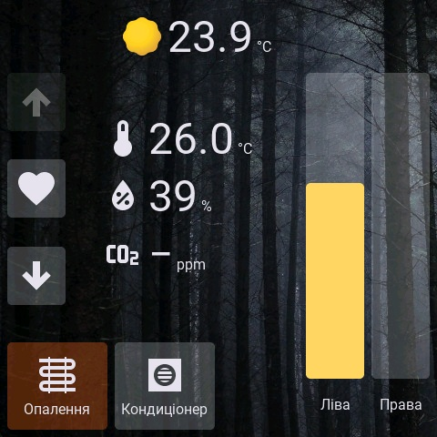

# Home Assistant Deck 2

HA Deck is an [ESPHome](https://esphome.io/) external component for building config-driven dashboards.

This is an improved version of the original [HA Deck](https://github.com/strange-v/ha_deck). It is implemented in a way, you can use ESPHome displays, touchscreens, fonts, images, sensors, and automations. It can run on the devices and platforms supported by ESPHome and LVGL.

HA Deck provides screens, themes, navigation, and ready-to-use dashboard widgets. You describe the interface in YAML and connect it to Home Assistant entities with standard ESPHome components and automations.



> [!IMPORTANT]
> HA Deck is currently a prototype and may contain bugs. Its API is not stable and will likely change. Updates may introduce breaking changes and are not guaranteed to be backward compatible.

## How to use

First, configure your display, touchscreen, fonts, images, and LVGL with the standard ESPHome components. Then add HA Deck as an external component:

```yaml
external_components:
  - source: github://strange-v/ha_deck2
    components: [ha_deck]
```

Add a theme and at least one screen:

```yaml
ha_deck:
  id: deck
  lvgl_id: main_lvgl
  default_theme: dashboard_theme
  default_screen: main_screen

  themes:
    - id: dashboard_theme
      fonts:
        text_small: roboto_16
        text_medium: roboto_48
        text_large: roboto_72
        icon_small: icons_24
        icon_medium: icons_48

  screens:
    - id: main_screen
      widgets:
        - button:
            id: light_button
            x: 24
            y: 24
            width: 160
            height: 80
            text: Living room
            toggle: true
            accent: light
            checked: !lambda return id(living_room_light).state;
            on_turn_on:
              - homeassistant.action:
                  action: light.turn_on
                  data:
                    entity_id: light.living_room
            on_turn_off:
              - homeassistant.action:
                  action: light.turn_off
                  data:
                    entity_id: light.living_room
```

The `lvgl_id` must point to your ESPHome LVGL component. Widget positions and sizes are in display pixels. Values such as `visible`, `checked`, and sensor readings can use ESPHome lambdas.

See the complete [configuration reference](docs/configuration.md) for the root component, themes, screens, widgets, and actions. Architectural details are in [docs/architecture.md](docs/architecture.md), and the development workflow is in [CONTRIBUTING.md](CONTRIBUTING.md). More examples are available in the [`examples`](examples) directory.

## Screens and themes

Each screen contains a list of widgets and can have its own background color or image. Open another screen from an automation:

```yaml
on_click:
  - ha_deck.screen.show:
      id: settings_screen
      animation: move_left
      time: 220ms
```

Change the active theme at runtime:

```yaml
on_click:
  - ha_deck.theme.set: light_theme
```

Themes provide shared colors, fonts, spacing, sizes, and named accents. Built-in accent names are `light`, `climate`, `heat`, and `dry`; `neutral` follows the active theme's foreground and background colors. You can override them or add your own.

## Weather icons

The weather widget includes icons based on [`@meteocons/svg-static`](https://github.com/basmilius/meteocons), created by Bas Milius and distributed under the MIT License. Attribution and license details are included in [`components/ha_deck/assets/weather`](components/ha_deck/assets/weather/README.md).

You can replace the built-in weather icons with your own SVG set. The screenshots for this project use icons from [Google Weather Icons](https://github.com/mrdarrengriffin/google-weather-icons). These icons are not bundled with HA Deck because of their licensing terms. See the [weather widget documentation](docs/configuration.md#weather) for information about using a custom icon directory.
